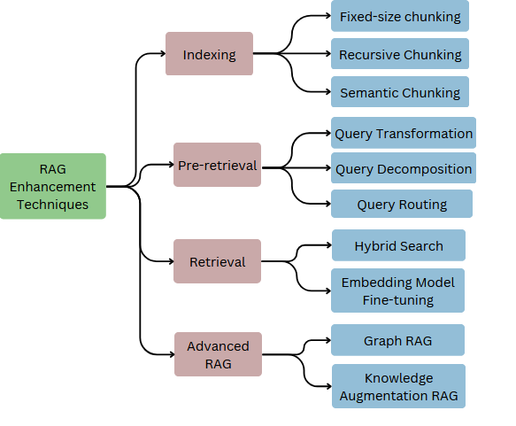

# # Retrieval-Augmented Generation (RAG) Techniques

Welcome to the **RAG Techniques Repository**! This repository serves as a comprehensive guide to understanding and implementing Retrieval-Augmented Generation (RAG) techniques.

---

## 📊 Overview

RAG combines retrieval mechanisms with generative models, enhancing tasks such as question answering, summarization, and document generation. This repository focuses on explaining, visualizing, and implementing key RAG techniques.

---

## 📂 Repository Contents

This repository includes:

1. **Graph of Techniques**: A detailed graph of RAG enhancement techniques.
2. **Jupyter Notebooks**: Hands-on implementations for each technique.
   - **Indexing Techniques**
   - **Graph RAG**
3. **Additional Notebooks** (Coming Soon):
   - Pre-retrieval
   - Retrieval
   - Knowledge Augmentation RAG
4. **Datasets**: Pre-configured datasets for experimentation.

---

## 🖼️ Visualization

Below is the **RAG Techniques Graph**, summarizing the techniques and their categories:

  
*(Ensure the image file is placed at `docs/images/rag-enhancement-techniques.png`.)*
